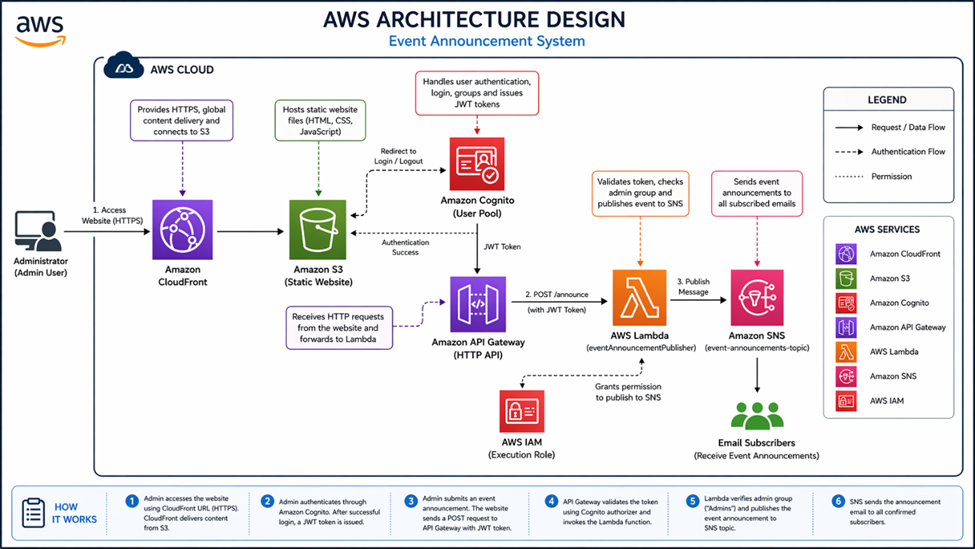
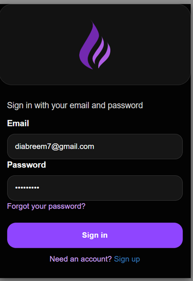
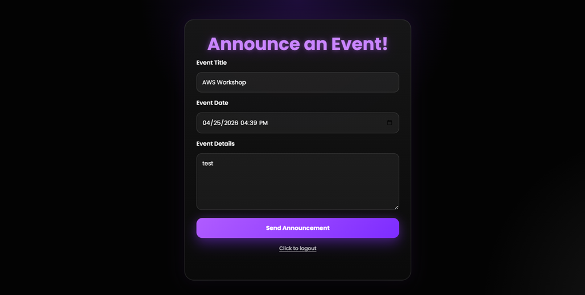
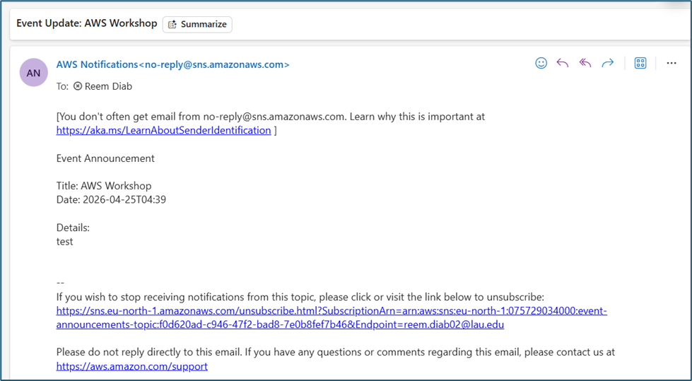

# Serverless Event Announcement System

A serverless AWS project that allows admins to send event announcements to subscribed users through email.

## AWS Services Used
- Amazon S3
- Amazon CloudFront
- Amazon Cognito
- AWS Lambda
- Amazon SNS
- API Gateway
- IAM

## Features
- Secure admin login using Cognito
- JWT authorization
- Serverless backend with Lambda
- Email notifications using SNS
- Static website hosting with S3 + CloudFront

## How It Works
1. Admin logs in using Cognito
2. Frontend sends request to API Gateway
3. Lambda validates admin role
4. SNS sends announcement emails

## System Architecture

---

## Cognito Sign In

---

## Frontend Interface

---

## Email Notification Result

